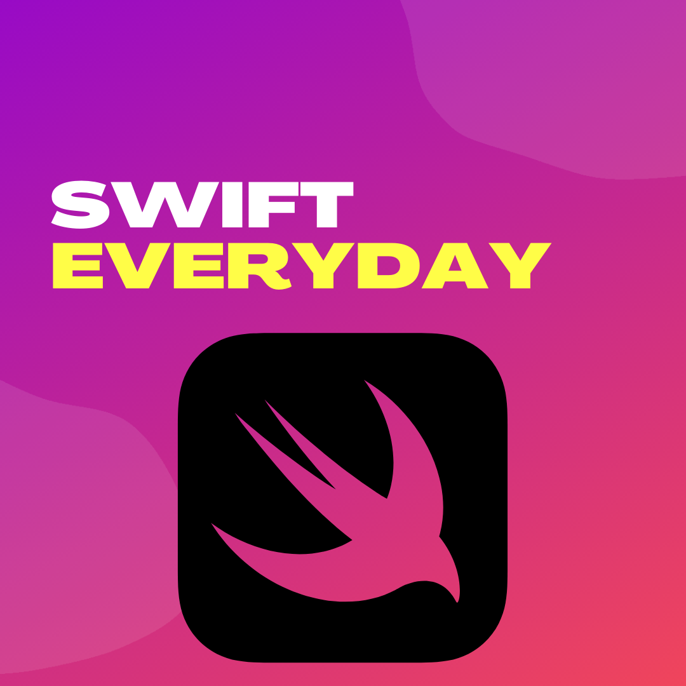

  

# Swift Everyday
--
Code from Youtube video series **Everyday's swift**:  
<a href="https://www.youtube.com/channel/UCuJ2oLnFjBfBrArVvPtdeDw">

  

 </a>
 [Watch on Youtube](https://www.youtube.com/channel/UCuJ2oLnFjBfBrArVvPtdeDw)

## Video List: 
1. [AppDelegate in SwiftUI](video-1/)
2. [callAsFunction in Swift 5.2](video-2/)
3. [Ep. #3: How to handle trailing closures properly and more ](https://www.youtube.com/watch?v=MZTsTV84avA)
4. [Ep #4: How to use full signature init() for VStack, HStack, ZStack](https://www.youtube.com/watch?v=jLDqW6aj5eQ)

**Swift Everyday** is a YourTube Series by Alok Choudhary.  
Reach me out: [htttp://alokchoudahry.com](htttp://alokchoudahry.com) 
